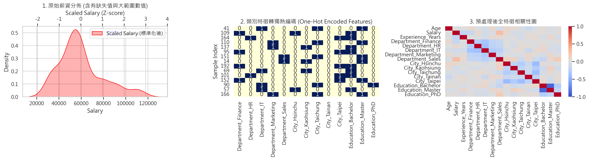
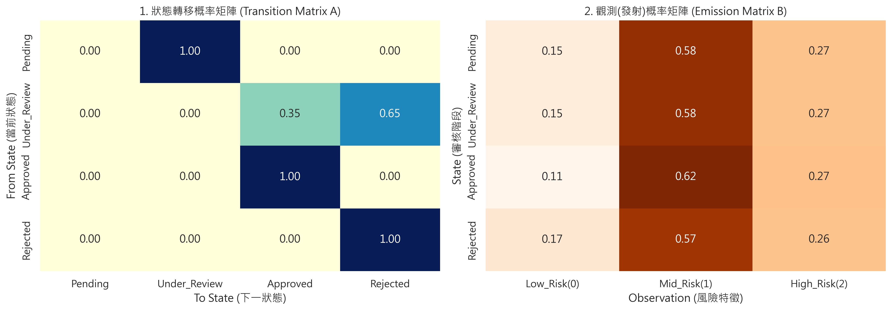

# 機器學習資料預處理與隱馬可夫模型（HMM）實作

這是以貸款申請範例資料建立的可重現機器學習教學專案。內容分成兩個已完成的單元：以 <code>scikit-learn</code> 建立資料預處理管道，以及以計數估計 HMM 機率矩陣、再用維特比演算法解碼一段示範觀測序列。

> **作品集定位：** 本專案展示資料清理、特徵轉換、可重現執行與 HMM 參數估計的工程流程；它不是經訓練或校準後可用於真實貸款核准的預測系統。

## 專案狀態與範圍

| 模組 | 狀態 | 實作範圍 |
| --- | --- | --- |
| 資料預處理 | 已完成 | 缺失值填補、標準化、One-Hot Encoding、80/20 分層切分與圖表輸出。 |
| HMM | 已完成 | 由標記的三步審核流程估計 $\pi$、$A$、$B$，並以 <code>CategoricalHMM</code> 執行維特比解碼。 |
| RNN | **尚未實作** | 儲存庫名稱源自課程章節；目前沒有 RNN 模型架構、訓練迴圈、權重或推論結果，不能宣稱具備 RNN 功能。 |

根目錄中名稱為 <code>清華大學出版社_機器學習_ch6標註工程與循環神經網路.py</code> 的檔案僅含 <code>python.py</code> 文字，並非可執行的 RNN 程式；保留它僅反映既有課程檔案，不納入本專案的可執行流程。

## 專案結構

~~~text
.
├── training_data.csv                         # 200 筆貸款申請範例資料
├── 訓練樣本預處理.py                          # 資料預處理與視覺化
├── 6-2_hmm_model.py                          # HMM 參數估計、維特比解碼與視覺化
├── requirements.txt                          # 已驗證的 Python 套件版本
├── preprocessing_result.png                  # 執行預處理程式後產生／更新
├── hmm_result.png                            # 執行 HMM 程式後產生／更新
└── README.md
~~~

## 資料輸入

兩支程式皆讀取專案根目錄的 <code>training_data.csv</code>。檔案以 UTF-8（可含 BOM）CSV 儲存，包含 200 筆範例資料與以下欄位：

| 欄位 | 型態／用途 |
| --- | --- |
| <code>Age</code>、<code>Salary</code>、<code>Experience_Years</code> | 數值特徵；預處理時以中位數補值並標準化。 |
| <code>Department</code>、<code>City</code>、<code>Education</code> | 類別特徵；預處理時以眾數補值並做 One-Hot Encoding。 |
| <code>Loan_Approved</code> | 目標標記；<code>1</code> 代表核准、<code>0</code> 代表拒絕。HMM 以它建構最終工作流程狀態。 |

程式會先檢查必要欄位。若替換資料，請保留上述欄名與 <code>Loan_Approved</code> 的 0/1 編碼；資料筆數可不同，但此專案的圖表與解讀是針對目前的教學資料設計。

## 環境安裝

已於 **Python 3.12.14** 及 <code>requirements.txt</code> 中鎖定的版本驗證。建議在專案目錄建立虛擬環境：

~~~bash
python -m venv .venv

# macOS / Linux
source .venv/bin/activate

# Windows PowerShell
# .venv\Scripts\Activate.ps1

python -m pip install --upgrade pip
python -m pip install -r requirements.txt
~~~

## 執行方式

可從任何工作目錄執行；程式會以自身所在位置尋找 CSV 並把 PNG 輸出回專案根目錄。

~~~bash
# 1. 建立訓練／測試切分、執行預處理並更新 preprocessing_result.png
python 訓練樣本預處理.py

# 2. 估計 HMM 矩陣、執行維特比示範並更新 hmm_result.png
python 6-2_hmm_model.py
~~~

預處理程式會在訓練集（80%，固定 <code>random_state=42</code> 且依 <code>Loan_Approved</code> 分層）上呼叫 <code>.fit_transform()</code>，再使用同一個轉換器處理測試集，避免測試資料洩漏。它會輸出轉換前後的特徵數、訓練／測試筆數、轉換後測試矩陣尺寸，以及 <code>preprocessing_result.png</code>。

HMM 程式會輸出資料筆數、<code>hmm_result.png</code>、固定示範觀測序列 <code>[0, 1, 2]</code> 的維特比路徑，以及 $\pi$ 與機率矩陣列和檢查結果。

## HMM 方法與程式對照

對每筆申請資料，程式依 <code>Loan_Approved</code> 建構已標記的三步流程：

- <code>Loan_Approved = 1</code>：<code>Pending → Under_Review → Approved</code>
- <code>Loan_Approved = 0</code>：<code>Pending → Under_Review → Rejected</code>

每個步驟的觀測值是由年齡與薪資計算的固定風險類別：

| 觀測值 | 規則 |
| --- | --- |
| 0（低風險） | <code>Salary > 70000</code> 且 <code>Age > 30</code> |
| 2（高風險） | <code>Salary < 45000</code> 或 <code>Age < 25</code> |
| 1（中風險） | 其餘情況；缺失的年齡或薪資未命中上述條件時也歸為此類。 |

令第 $k$ 條已標記序列的第 $t$ 個狀態與觀測分別為 $s_t^{(k)}$、$o_t^{(k)}$。程式以計數正規化估計：

$$
\hat{\pi}_i = \frac{\#\{k:s_0^{(k)}=i\}}{N}, \qquad
\hat{A}_{ij} = \frac{\#\{(k,t):s_t^{(k)}=i, s_{t+1}^{(k)}=j\}}{\#\{(k,t):s_t^{(k)}=i\}},
$$

$$
\hat{B}_{i,o} = \frac{\#\{(k,t):s_t^{(k)}=i, o_t^{(k)}=o\}}{\#\{(k,t):s_t^{(k)}=i\}}.
$$

未出現在流程中的終點外出轉移會被設成自迴圈，使 $A$ 的每列皆為合法機率分布。若輸入資料完全沒有某個狀態，程式會以均勻分布作為該狀態 $B$ 的防禦性預設值。接著把 $\hat{\pi}$、$\hat{A}$、$\hat{B}$ 指定給 <code>hmmlearn.hmm.CategoricalHMM</code>，並以 Viterbi 演算法解碼固定的示範序列。

這不是 <code>model.fit()</code> 從未標記資料學得的隱狀態模型：狀態序列是由 <code>Loan_Approved</code> 建構，且同一筆申請的風險觀測值會在三個時間步重複。因此輸出的解碼只用於說明 HMM 機率結構與 API 使用，不應解讀為對真實申請流程的預測或因果分析。

## 結果輸出

兩張 PNG 會在每次執行對應程式時更新。HMM 圖左為狀態轉移矩陣 $A$，圖右為發射機率矩陣 $B$；實際數值取決於 <code>training_data.csv</code>。

## 基本驗證

在上述已鎖定環境中執行以下檢查：

~~~bash
python -m compileall 訓練樣本預處理.py 6-2_hmm_model.py
python 訓練樣本預處理.py
python 6-2_hmm_model.py
~~~

預期兩支程式皆結束碼為 0，並在專案根目錄生成／更新兩張 PNG。HMM 的主控台最後一行應回報 <code>pi=1.00</code> 與 <code>A rows=True, B rows=True</code>。

## 後續可擴充方向

- 建立真正的時序資料集與切分策略，避免以同一列特徵重複成三個觀測步。
- 將 HMM 做為基準模型後，再加入獨立的 RNN（如 PyTorch LSTM/GRU）訓練、驗證指標與推論範例。
- 新增單元測試與資料驗證，並在持續整合環境中執行。
